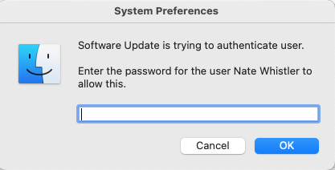

# Prompt for a Mac User Password

I built a BADUSB script for running a bash script from Github that prompts the user for a password in a pretty convincing way and saves it to a text file. I've tested this on the [Flipper Zero](https://flipperzero.one/).

## <b>Usage</b>
1. Modify the `MacOS-pwn.txt` with the switch commands you prefer to use.
    * To run the commands change the `| bash` to `bash -s -- -n 2` - 2 is an example of amount of times to run the prompt.
2. Copy either your modified `MacOS-pwn.txt` or the original to the device you use to trigger it. In my case, my Flipper Zero. 
3. Run the command on the host you are trying to infiltrate.

## <b>New! Switch Commands</b>

`-c` Does a clean mode and removes the pass.txt file at the end of the script execution.
  `-o` Send the output to `onetimesecret.com` and generate a secret url.
  `-n #` Specify how many times open the pop-up. Use it to <i>really</i> make sure you get that password. Example `./prompt.sh -n 3` runs the command three times.

## <b>New! Added an Admin check</b>

Now the script will check if the user is an admin and put that in the output.

### Todo
- [X] Build a loop for prompt command
- [X] Build run switches to specify how many times to run the loop. 
- [X] Setup a delivery mechanism for saved password file - onetimesecret.com
- [X] Create clean-up commands for the script.
- [ ] Run a port scan looking for open ports i.e. `ssh`.