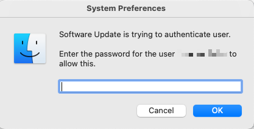

# Prompt for a Mac User Password

I built a duckyscript for running a bash script from Github that prompts the user for a password in a pretty convincing way and saves it to a text file.

I am working on setting up the prompt to run in a loop with the ability to specify in the script how many times to run. My ideal state is to run this three times to 1. be annoying and 2. really capture that password.

### Todo
- [ ] Build a loop for prompt command
- [ ] Build run switches to specify how many times to run the loop. 
- [ ] Setup a delivery mechanism for saved password file
- [ ] Create clean-up commands for the script.